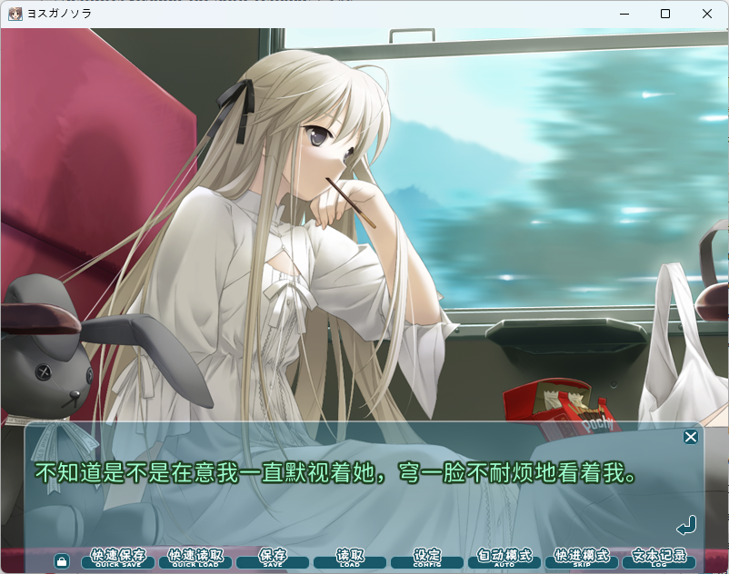
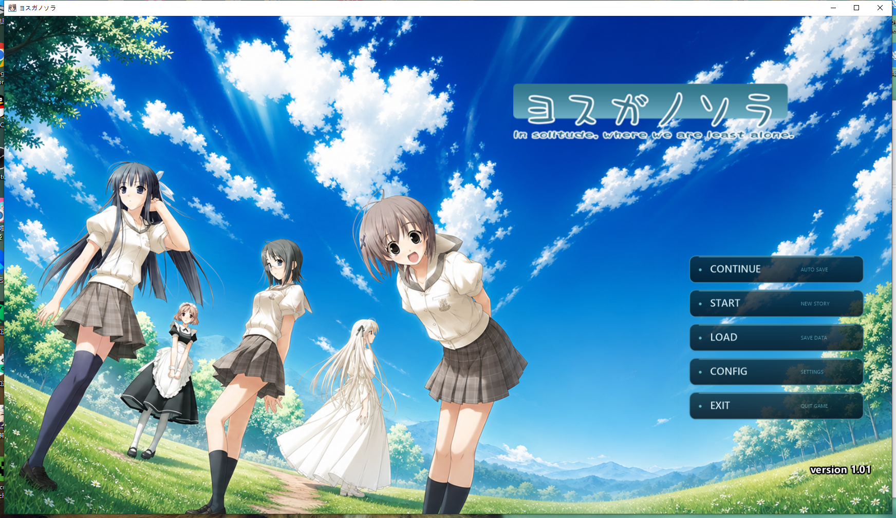

### Yosuga no Sora Remake

A community-driven remake/modernization project of the classic visual novel **Yosuga no Sora** (Sphere, 2008). This repository aims to bring the beloved story to modern platforms with updated visuals and improved compatibility.



> **Note:** This project is a fan-made work and is not affiliated with Sphere or CUFFS.

#### Features
- **Modern Engine:** Rebuilt using [Insert Engine Name] for better performance.
- **HD Graphics:** Support for high-resolution displays and upscaled assets.
- **Cross-Platform:** Compatible with Windows, macOS, and Linux.
- **Enhanced UI:** A revamped user interface for a smoother reading experience.

#### Getting Started

1. Clone the repository:
   ```bash
   git clone https://github.com/sempre0721/yosuga-no-sora-remake.git
   cd yosuga-no-sora-remake
   ```

2. Run the game executable or script directly:
   ```bash
   # Example command (modify based on your actual file)
   ./tvpwin32.exe
   ```
3、By the way,this repo only had some code files without images nor musics,if you wanna play the galgame directly,please join the QQ group **1105302325** and download from 139cloudpan.

#### Community & Discussion
We welcome everyone to discuss ideas, share feedback, and contribute to the project!


#### Contributing
Contributions are welcome! If you'd like to help with translation, coding, or art, please feel free to open an issue or submit a pull request.

1. Fork the Project
2. Create your Feature Branch (`git checkout -b feature/AmazingFeature`)
3. Commit your Changes (`git commit -m 'Add some AmazingFeature'`)
4. Push to the Branch (`git push origin feature/AmazingFeature`)
5. Open a Pull Request

#### Legal & Disclaimer
This project is intended for educational and preservation purposes only. All original assets, characters, and story elements belong to their respective owners (**Sphere / CUFFS**). Please support the official release if you enjoy the game.

#### License
Distributed under the MIT License. See `LICENSE` for more information.
